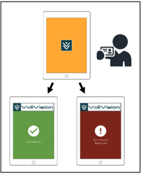

# ValiVision
A cross‐platform Xamarin app that universally validates student status.

## Project Overview

ValiVision is a cross‐platform app that universally validates student status. Any vendor using our service can check
that their customers are using a student card from a recognised institute. Furthermore, using custom vision and
machine learning technology, ValiVision can check that a presented student card belongs to the person using it,
and that it has not expired. 

Our service also provides useful data analysis to our customers as it collects anonymous
demographic‐based information through its verification process, such as age, sex, country of institution, student
type e.g. tertiary or high school, and time of validation. 

This information can be used by our customers to further
tailor their products and services. Our app can be used on any device with a camera, which means it is highly
accessible as it does not require expensive, specialised equipment.

